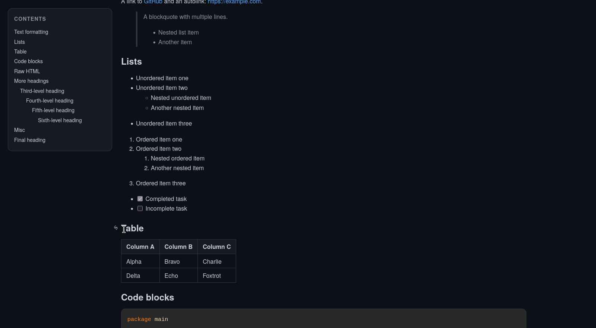

# ghmd

`ghmd` is a small Go CLI for rendering Markdown to HTML using [Goldmark](https://github.com/yuin/goldmark).

It aims to be close to GitHub-flavored Markdown rendering and includes:

- GitHub-flavored Markdown features
- syntax highlighting for fenced code blocks
- selectable highlighting themes
- table of contents generation
- clickable heading anchors
- Mermaid diagram support
- footnotes
- raw HTML support

## Demo



## Usage

Render a Markdown file to HTML:

```bash
go run . -i input.md -o output.html
```

Or read from stdin and write to stdout:

```bash
cat input.md | go run . > output.html
```

Start HTTP server for directory browse + Markdown render:

```bash
go run . -server
# or
go run . -server ./docs -host 0.0.0.0 -port 8080
```

## Flags

- `-i` — input Markdown file, defaults to stdin
- `-o` — output HTML file, defaults to stdout
- `-title` — override the HTML page title
- `-theme` — syntax highlighting theme
- `-toc-min-level` — minimum heading level included in the TOC
- `-toc-max-level` — maximum heading level included in the TOC
- `-open` — open the generated HTML in your browser
- `-server` — start HTTP server; optional root dir path
- `-host` — server host
- `-port` — server port

## Theme options

Use `-theme` to choose the code highlighting theme.

Available values are the Chroma styles exposed by Goldmark highlighting, including:

`abap`, `algol`, `algol_nu`, `arduino`, `autumn`, `average`, `base16-snazzy`, `borland`, `bw`, `colorful`, `doom-one`, `doom-one2`, `dracula`, `emacs`, `friendly`, `fruity`, `github`, `gruvbox`, `hr_high_contrast`, `hrdark`, `igor`, `lovelace`, `manni`, `monokai`, `monokailight`, `murphy`, `native`, `nord`, `onesenterprise`, `paraiso-dark`, `paraiso-light`, `pastie`, `perldoc`, `pygments`, `rainbow_dash`, `rrt`, `solarized-dark`, `solarized-dark256`, `solarized-light`, `swapoff`, `tango`, `trac`, `vim`, `vs`, `vulcan`, `witchhazel`, `xcode`, `xcode-dark`

## Example

Markdown input:

````md
# Hello

Some `inline code`.

## Section

```go
fmt.Println("hi")
```


A footnote reference.[^1]

[^1]: Footnote text.
````

## Notes

- Heading anchors are inserted automatically.
- The table of contents includes headings from level 2 through 6 by default.
- Mermaid diagrams are rendered client-side using the Mermaid CDN.
- Raw HTML is allowed in the rendered output.

## Home Manager

Use flake module to run `ghmd` as user service:

```nix
{
  inputs.ghmd.url = "github:0xferrous/ghmd";

  outputs = { self, ghmd, home-manager, ... }: {
    homeConfigurations.alice = home-manager.lib.homeManagerConfiguration {
      pkgs = import nixpkgs { system = "x86_64-linux"; };
      modules = [
        ghmd.homeManagerModules.default
        {
          programs.ghmd.enable = true;
          programs.ghmd.rootDir = "/home/alice/docs";
          programs.ghmd.host = "127.0.0.1";
          programs.ghmd.port = 8080;
          programs.ghmd.theme = "github";
        }
      ];
    };
  };
}
```

## Development

Format the project:

```bash
gofmt -w main.go
```

## License

MIT
