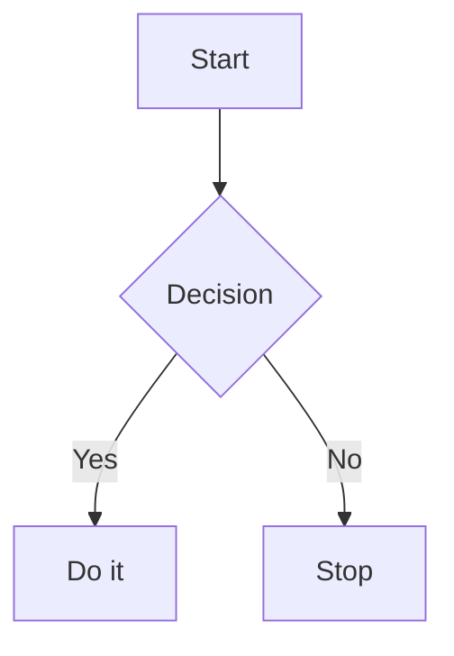
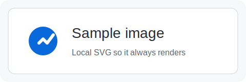

# Sample Document

This file is meant to exercise the Markdown renderer as much as possible.

## Text formatting

Regular paragraph with **bold**, *italic*, ~~strikethrough~~, and `inline code`.

A link to [GitHub](https://github.com) and an autolink: https://example.com.

> A blockquote with multiple lines.
>
> - Nested list item
> - Another item

## Lists

- Unordered item one
- Unordered item two
  - Nested unordered item
  - Another nested item
- Unordered item three

1. Ordered item one
2. Ordered item two
   1. Nested ordered item
   2. Another nested item
3. Ordered item three

- [x] Completed task
- [ ] Incomplete task

## Table

| Column A | Column B | Column C |
| -------- | -------- | -------- |
| Alpha    | Bravo    | Charlie  |
| Delta    | Echo     | Foxtrot  |

## Code blocks

```go
package main

import "fmt"

func main() {
	fmt.Println("hello, world")
}
```

```python
from dataclasses import dataclass

@dataclass
class Point:
    x: int
    y: int
```



## Raw HTML

<div class="callout">
  <strong>Raw HTML</strong> should render because unsafe HTML is enabled.
</div>

## More headings

### Third-level heading

Some text under an H3.

#### Fourth-level heading

Some text under an H4.

##### Fifth-level heading

Some text under an H5.

###### Sixth-level heading

Some text under an H6.

## Misc

An image reference:



A horizontal rule:

---

A real footnote reference.[^1]

## Final heading

End of document.

[^1]: This is a real footnote definition.
